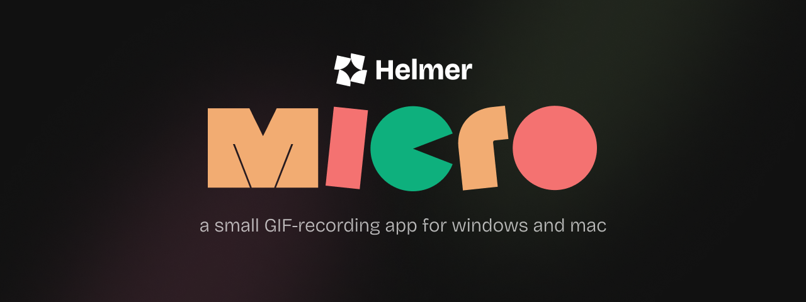

# Helmer Micro

Helmer Micro is a cross-platform GIF recording app. It's open-source and built using the awesome [Tauri](https://github.com/tauri-apps/tauri) framework, [Gifski](https://github.com/ImageOptim/gifski) the GIF encoder, and our high-performance capture engine [scap](https://github.com/helmerapp/scap).

> ⚠️ This project is in Beta. Please use at your own risk.

## Motivation

GIFs are clearly the internet's favourite file format, but notoriously hard to create. We, the team behind [Helmer](https//www.helmer.app), wanted to create a small tool to make it easy and effortless for everyone!

Alongside our tiny quest this app is also:

1. a demo of our libraries [scap](https://github.com/helmerapp/scap) and [henx](https://github.com/helmerapp/henx) 🛠️
2. a call to make more OSS apps that are beautifully designed! 💖

## COSS?

Yup, Commercial Open-source Software!

Many of the tools and libraries we author are kept updated and made available to everyone though Github and other platforms. We believe in operating with transparency, building alongside our community, and supporting peer OSS projects along the way. This way everyone collectively benefits from and improves each other's work, instead of running circles within their own walled gardens.

If you'd like to support us, we request that you buy a license via [our website](https://www.helmer.app/micro) — it will allow us to become a sustainable business and eventually count towards a credible way of funding our work and experiments.

Of course, you are more than welcome to build your own binaries using our source code for free! Please reach out in the `#micro` channel on our Discord if you need help setting this up.

Lastly: don't forget to share your GIFs online with a `#MadeWithMicro` hashtag, we'd love to see and share what you make! 🫶

## Development

### Pre-requisites

1. Set up all the [Tauri Pre-requisites](https://beta.tauri.app/guides/prerequisites/)
2. Install [NodeJS](https://nodejs.org/en) 20.0 (or newer)
3. Install Yarn by running `npm install --global yarn`

### Guide

Our app is written with Tauri using Typescript and Rust. The frontend is powered by [Astro](https://astro.build)

1. To spin up the dev environment, run `yarn tauri dev`
2. To build the app for your current OS/architecture, run `yarn tauri build`
3. Follow the [Conventional Commits](https://www.conventionalcommits.org/en/v1.0.0/#specification) spec to name branches and commits
